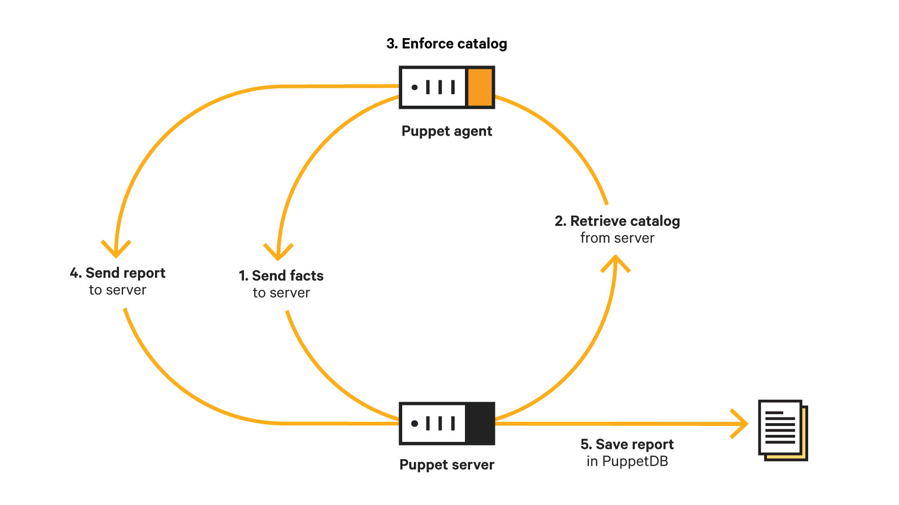

# How APIs are used in the normal operation of Puppet

## Documentation

<https://puppet.com/docs/puppet/latest/subsystem_agent_primary_comm.html>

## Education

This isn't taught in GSWP which sucks.

It is taught properly in Practitioner.

## Other

We don't have any real homework for this, but the fact that PSEs need to be able to teach Practitioner means that they will naturally have to learn it
